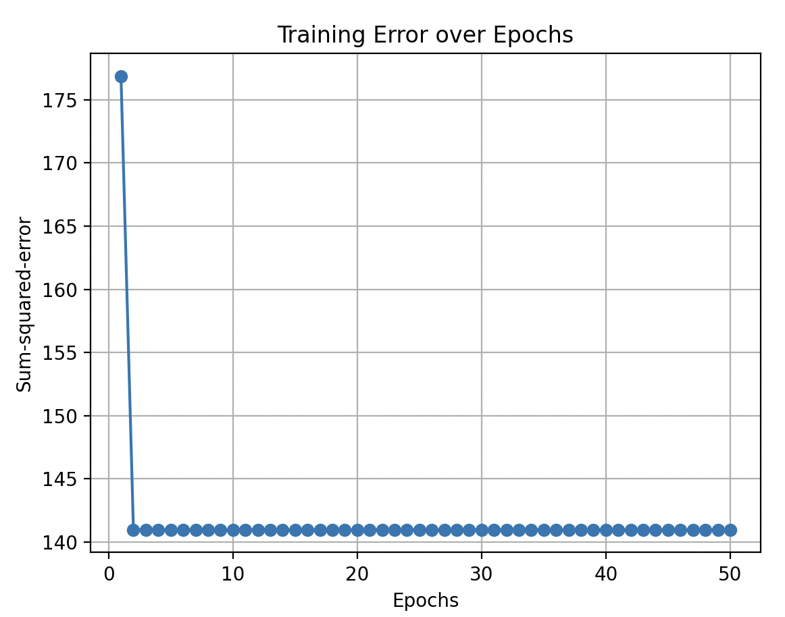
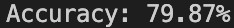

# ADALINE Network for Predicting Diabetes Using Pima Indians Dataset


## Table of Contents
- [1. Project Overview](#1-project-overview)
- [2. Context](#2-context)
- [3. Dataset](#3-dataset)
- [4. Data Preprocessing](#4-data-preprocessing)
- [5. Model Implementation](#5-model-implementation)
- [6. Training and Evaluation](#6-training-and-evaluation)
- [7. Visualization](#7-visualization)
- [8. Accuracy](#8-accuracy)


## 1. Project Overview

The goal of this project is to train an ADALINE (Adaptive Linear Neuron) network to predict diabetes based on biometric data from the Pima Indians Diabetes Dataset.

## 2. Context
The Pima Indian Tribe has one of the highest diabetes cases (more than half of the adults have diabetes type 2), which makes it easier for the network to predict the disease.<br> With around 80% accuracy my network is relatively good at it.

## 3. Dataset

The Pima Indians Diabetes Dataset consists of biometric measurements for women over 21 years of Pima Native American heritage. <br> The dataset contains the following biometrical data:
- Number of pregnancies
- Glucose
- Blood Pressure
- Skin Thickness
- Insulin
- BMI (Body Mass Index)
- DiabetesPedigreeFunction 
(Function for the probability of diabetes based on family history)
- Age
- Outcome (0 for normal and 1 for diabetes)

## 4. Data Preprocessing

```python
import csv
import numpy as np

# Load and preprocess data
dataset = []
with open('diabetes.csv') as f:
    csv_reader = csv.reader(f)
    next(csv_reader)
    for row in csv_reader:
        dataset.append([float(value) for value in row])
dataset = np.array(dataset)
x = dataset[:, :-1]
y = dataset[:, -1]
# Normalize features
x = (x - np.mean(x, axis=0)) / np.std(x, axis=0)
# Split into training and test data
splittingIndex = int(len(dataset) * 0.8)
x_train = x[:splittingIndex]
x_test = x[splittingIndex:]
y_train = y[:splittingIndex]
y_test = y[splittingIndex:]
```
## 5. Model Implementation

```python
class Adaline:
    def __init__(self, input_size) -> None:
        self.W = np.random.uniform(-1, 1, input_size)  # input_size means the number of weights
        self.b = random.uniform(-1, 1)  

    def predict(self, x: np.array):
        if np.dot(self.W, x) + self.b>=0.5:
            return 1
        else: 
            return 0
    
    def train_perceptron(self, training_data, stop, learning_rate:float, n:int, plot=False):
        errors = [stop + 1]  # Start with a large error to ensure the loop runs
        epoch = 0
        error_history = [] # for plotting
        while errors[-1] > stop and epoch < n:
            Error = []
            for x, target in training_data:
                y = np.dot(self.W, x) + self.b  # No activation function for Adaline
                error = target - y
                self.W += learning_rate * error * x
                self.b += learning_rate * error  # Bias update includes learning rate
                Error.append(error ** 2)
            errors.append(sum(Error))
            error_history.append(sum(Error)) # for plotting
            epoch += 1


        # Plot error history
        if plot:
            plt.plot(range(1, len(error_history) + 1), error_history, marker='o')
            plt.xlabel('Epochs')
            plt.ylabel('Sum-squared-error')
            plt.title('Training Error over Epochs')
            plt.grid()
            plt.show()
        return self.W, self.b
```
 ## 6. Training and Evaluation

```python
def testAdaline(X_train, Y_train, X_test, Y_test, stop=0.1, learning_rate=0.05, n=20, plot=True):
    input_size = X_train.shape[1]
    training_data = [(x_train[i], Y_train[i]) for i in range(len(Y_train))]
    correct_predictions = 0
    network = Adaline(input_size)
    weights, bias = network.train_perceptron(training_data, stop, learning_rate, n, plot)# stop, learning rate, number of epochs and boolean for plot
    for x, expected_output in zip(X_test, Y_test):
                prediction = network.predict(x)
                if prediction==expected_output:
                    correct_predictions += 1
    accuracy = (correct_predictions / len(X_test))* 100
    print(f'Accuracy: {accuracy:.2f}%')
    return accuracy
```
## 7. Visualization

### Error Plot
```python
plt.plot(range(1, len(error_history) + 1), error_history, marker='o')
plt.xlabel('Epochs')
plt.ylabel('Sum-squared-error')
plt.title('Training Error over Epochs')
plt.grid()
plt.show()
```
Here's a screenshot of the error plot while training:



## 8. Accuracy
The model reached a top accuracy of:<br>

